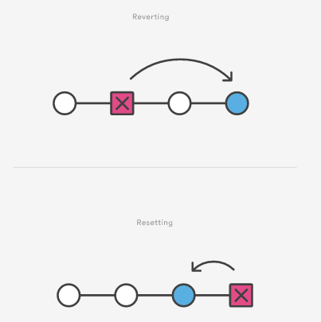

#  git-revert

Отмена с помощью команды revert необходима, когда нужно обратить изменения, внесенные в некоем коммите из истории проекта. Это может быть полезно, если баг появился в проекте из-за конкретного коммита. Вам не потребуется вручную переходить к этому коммиту, исправлять его и выполнять коммит нового снимка состояния — команда **git revert** сделает это автоматически.

Команда **git revert** используется для отката изменений в истории коммитов репозитория. Другие команды отмены, такие как **git checkout** и **git reset**, перемещают указатель HEAD и указатели ветки на определенный коммит. Команда **git revert** также работает с определенным коммитом, однако использование **git revert** не перемещает указатели. При операции revert совершается переход к указанному коммиту, обращаются его изменения и создается новый, «обратный» коммит. Затем позиция указателей обновляется — они перемещаются к этому коммиту в конце ветки.

## Разница между командами **git reset** и **git revert** 

Команда **git revert** отменяет одиночный коммит, но не возвращает проект в предшествовавшее состояние с удалением всех последующих коммитов. Такой результат в Git дает команда **reset**, а не **revert**.

&nbsp;&nbsp;&nbsp;&nbsp;

Целью для команды **git revert** можно выбрать любой отдельный коммит в истории проекта, в то время как действие команды **git reset** способна отменять только самый последний коммит.

